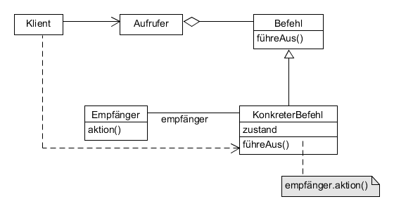

# Command example

Kapselt einen Befehl als Objekt.

_Charakteristisch_: Methode `führeAus()`oder eng. `execute()` des Befehlsobjekts.



**Participants:**

* Command: declares an interface for executing an operation.
* ConcreteCommand: defines a binding between a Receiver object and an action; implements `execute()` method by invoking the corresponding operation(s) on Receiver.
* Client: creates a ConcreteCommand object and sets its receiver.
* Invoker: asks the Command to carry out the request by calling its `execute()` method.
* Receiver: knows how to perform the operations needed to carry out a request; any class can act as a Receiver.

**Command:**

  ```java
  public abstract class Order {
      protected Item item;

      public Order(Item item) {
          this.item = item;
      }

      abstract void execute();
  }
  ```

**ConcreteCommandA:**

  ```java
  public class BuyItem extends Order {
      public BuyItem(Item item) {
          super(item);
      }

      @Override
      void execute() {
          item.buy();
      }
  }
  ```

**ConcreteCommandB:**

  ```java
  public class SellItem extends Order {
      public SellItem(Item item) {
          super(item);
      }

      @Override
      void execute() {
          item.sell();
      }
  }
  ```

**Receiver:**

  ```java
  public class Item {
      private String name;
      private int quantity;

      public Item(String name, int quantity) {
          this.name = name;
          this.quantity = quantity;
      }

      public void buy() {
          System.out.println("Buy [Name: " + name + ", Quantity: " + quantity + "]");
      }

      public void sell() {
          System.out.println("Sell [Name: " + name + ", Quantity: " + quantity + "]");
      }
  }
  ```

**Invoker:**

  ```java
  public class Player {
      private List<Order> orderList = new ArrayList<>();

      public void takeOrder(Order order) {
          orderList.add(order);
      }

      public void placeOrders() {
          orderList.forEach(order -> order.execute());
          orderList.clear();
      }
  }
  ```

**Demo:**

  ```java
  public class Main {
      public static void main(String[] args) {
          BuyItem buy = new BuyItem(new Item("Quafe", 500));
          SellItem sell = new SellItem(new Item("Carbon", 1000));

          Player player = new Player();
          player.takeOrder(buy);
          player.takeOrder(sell);

          player.placeOrders();
      }
  }
  ```

**Output:**

  ```
  Buy [Name: Quafe, Quantity: 500]
  Sell [Name: Carbon, Quantity: 1000]
  ```
