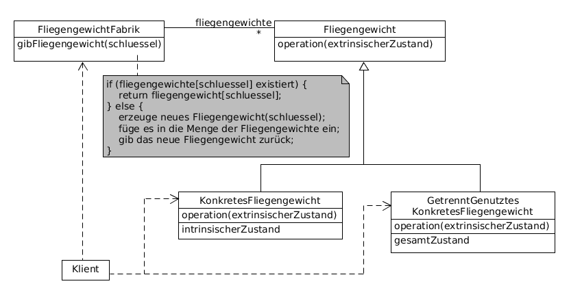

# Flyweight example

Objekte kleinster Granularität werden gemeinsam genutzt, um große Mengen von ihnen effizient speichern zu können.

Intrinsischer Zustand: für alle Exemplare gemeinsam (unabhängig vom Einsatzkontext), wird in der Fliegengewicht-Instanz gespeichert

Extrinsischer Zustand: für jedes Exemplar unterschiedlich, wird in externer Datenstruktur gespeichert, nur im Verwendungskontext des Fliegengewichts bekannt



**Participants:**

* Flyweight: declares an interface through which flyweights can receive and act on extrinsic state.
* ConcreteFlyweight: implements the Flyweight interface and adds storage for intrinsic state, if any. A ConcreteFlyweight object must be sharable.
* UnsharedConcreteFlyweight: may have ConcreteFlyweight objects as children at some level.
* FlyweightFactory: creates and manages flyweight objects; ensures that flyweights are shared properly.

**Flyweight:**

  ```java
  public interface Shape {
    void draw();
  }
  ```

**ConcreteFlyweight:**

  ```java
  public class Circle implements Shape {
      private int x;
      private int y;
      private int radius;
      private String color;

      public Circle(String color) {
          this.color = color;
      }

      public void setX(int x) {
          this.x = x;
      }

      public void setY(int y) {
          this.y = y;
      }

      public void setRadius(int radius) {
          this.radius = radius;
      }

      @Override
      public void draw() {
          System.out.println("Drawing circle at [x: " + x + ", y: " + y + "], radius: " + radius + ", color: " + color);
      }
  }
  ```

**FlyweightFactory:**

  ```java
  public class ShapeFactory {
      private static final HashMap<String, Shape> circleMap = new HashMap<>();

      public static Shape getCircle(String color) {
          Circle circle = (Circle) circleMap.get(color);

          if (circle == null) {
              circle = new Circle(color);
              circleMap.put(color, circle);
              System.out.println("Creating circle of color: " + color);
          }

          return circle;
      }
  }
  ```

**Demo:**

  ```java
  public class FlyWeightDemo {
      private static final String colors[] = {"Red", "Green", "Blue"};

      public static void main(String[] args) {
          for (int i = 0; i < 5; i++) {
              Circle circle = (Circle) ShapeFactory.getCircle(getRandomColor());

              circle.setX(getRandomNumber());
              circle.setY(getRandomNumber());
              circle.setRadius(getRandomNumber() + 1);

              circle.draw();
          }
      }

      private static String getRandomColor() {
          return colors[(int) (Math.random() * colors.length)];
      }

      private static int getRandomNumber() {
          return (int) (Math.random() * 100);
      }
  }
  ```

**Output:**

  ```
  Creating circle of color: Green
  Drawing circle at [x: 28, y: 25], radius: 23, color: Green

  Creating circle of color: Red
  Drawing circle at [x: 61, y: 84], radius: 42, color: Red

  Creating circle of color: Blue
  Drawing circle at [x: 75, y: 44], radius: 2, color: Blue

  Drawing circle at [x: 69, y: 34], radius: 89, color: Green

  Drawing circle at [x: 59, y: 30], radius: 39, color: Red
  ```
