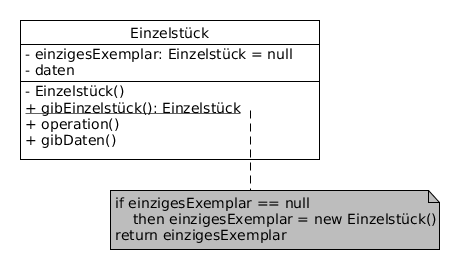

# Singleton example

Bearbeiten den Zustand von Objekten, unabhängig von deren Zweck.



**Participant:**

* Singleton: defines an Instance operation that lets clients access its unique instance.

**Singleton:**

  ```java
  public class Pikachu {
    private static Pikachu instance = null;
    private String master = null;

    private Pikachu() {
    }

    public static Pikachu getInstance() {
      if (instance == null) {
        instance = new Pikachu();
      }
      return instance;
    }

    public void setMaster(String master) {
      this.master = master;
    }

    public void printMaster() {
      if (master == null) {
        System.out.println("Pikachu has no master.");
      } else {
        System.out.println("Pikachu's master is " + master + ".");
      }
    }
  }
  ```

**Demo:**

  ```
  public class Main {
    public static void main(String[] args) {
      Pikachu pika = Pikachu.getInstance();
      pika.setMaster("Ash");
      pika.printMaster();

      Pikachu pika2 = Pikachu.getInstance();
      pika2.printMaster();

      pika2.setMaster("Brock");
      pika2.printMaster();
      pika.printMaster();
    }
  }
  ```

**Output:**

  ```
  Pikachu's master is Ash.
  Pikachu's master is Ash.
  Pikachu's master is Brock.
  Pikachu's master is Brock.
  ```
