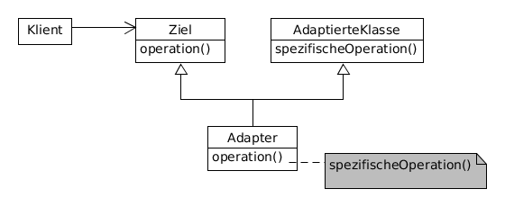

# Adapter example



**Participants:**

* Target: defines the domain-specific interface that Client uses.
* Client: collaborates with objects conforming to the Target interface.
* Adaptee: defines an existing interface or class that needs adapting. 
* Adapter: adapts Adaptee to the Target interface.

**Target:**

  ```java
  public interface Sorter {
    int[] sort(int[] numbers);
  }
  ```
  
**Client:**

  ```java
  public class Main {
    public static void main(String[] args) {
      int[] numbers = {4, 2, 1, 3};
      Sorter s = new SorterAdapter();
      int[] sortedNumbers = s.sort(numbers);
      for (int i : sortedNumbers) {
          System.out.print(i + " ");
      }
    }
  }
  ```
  
**Adaptee:**

  ```java
  public class IntegerSorter {
    private List<Integer> numbers;

    public IntegerSorter(int[] numbers) {
      this.numbers = Arrays.stream(numbers).boxed().collect(Collectors.toList());
    }

    public List<Integer> sort() {
      Collections.sort(numbers);
      return numbers;
    }
  }
  ```

**Adapter:**

  ```java
  public class SorterAdapter implements Sorter {
    @Override
    public int[] sort(int[] numbers) {
      List<Integer> sortedNumbers = new IntegerSorter(numbers).sort();
      int[] result = sortedNumbers.stream().mapToInt(i -> i).toArray();
      return result;
    }
  }
  ```
