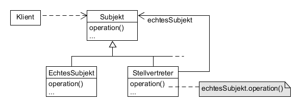

# Proxy example

Kontrolliert den Zugriff auf ein Objekt mit Hilfe eines vorgelagerten Stellvertreterobjekts.

*Anwendungen*: remote proxy, virtual proxy, firewall



**Participants:**

* Subject: defines the common interface for RealSubject and Proxy so that a Proxy can be used anywhere a RealSubject is expected.
* RealSubject: defines the real object that the proxy represents.
* Proxy: maintains a reference that lets the proxy access the real subject; provides an interface identical to Subject's so that a proxy can by substituted for the real subject; controls access to the real subject.

**Subject:**

  ```java
  public interface Image {
    void display();
  }
  ```
  
**RealSubject:**

  ```java
  public class RealImage implements Image {
    private String fileName;

    public RealImage(String fileName) {
      this.fileName = fileName;
      load(fileName);
    }

    @Override
    public void display() {
      System.out.println("Displaying: " + fileName);
    }

    private void load(String fileName) {
      System.out.println("Loading: " + fileName);
    }
  }
  ```
  
**Proxy:**

  ```java
  public class ImageProxy implements Image {
    private RealImage realImage;
    private String fileName;

    public ImageProxy(String fileName) {
      this.fileName = fileName;
    }

    @Override
    public void display() {
      if (realImage == null) {
        realImage = new RealImage(fileName);
      }
      realImage.display();
    }
  }
  ```
  
**Demo:**

  ```java
  public class Main {
    public static void main(String[] args) {
      Image image = new ImageProxy("test-image.jpg");
      image.display();
      System.out.println("");
      image.display();
    }
  }
  ```
  
**Output:**

  ```
  Loading: test-image.jpg
  Displaying: test-image.jpg

  Displaying: test-image.jpg
  ```
  
**Compared with [Adapter](https://github.com/YuKitAs/tech-note/blob/master/design-patterns/decoupling-patterns/adapter-example.md) design pattern:** 

An Adapter provides a different interface to the object it adapts, a Proxy provides the same interface as its subject.
