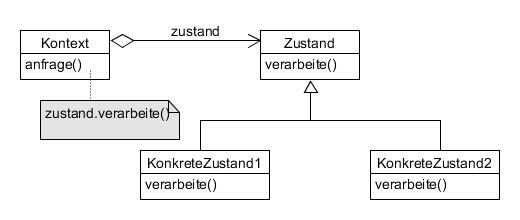

# State example

Ändert das Verhalten eines Objekts, wenn sich dessen interner Zustand ändert.



**Participants:**

* Context: defines the interface of interest to clients; maintains an instance of a ConcreteState that defines the current state.
* State: defines an interface for encapsulating the behavior associated with a particular state of the Context.
* ConcreteState: each subclass implements a behavior associated with a state of the Context.

**Context:**

  ```java
  public class Context {
    private State state;

    public Context() {
      state = null;
    }

    public void setState(State state) {
      this.state = state;
    }

    public State getState() {
      return state;
    }
  }
  ```
  
**State:**

  ```java
  public interface State {
    void doAction(Context context);
  }
  ```
  
**ConcreteStateA:**

  ```java
  public class StartState implements State {
    @Override
    public void doAction(Context context) {
      System.out.println("starting...");
      context.setState(this);
    }

    @Override
    public String toString() {
      return "Start";
    }
  }
  ```
  
**ConcreteStateB:**

  ```java
  public class StopState implements State {
    @Override
    public void doAction(Context context) {
      System.out.println("stopping...");
      context.setState(this);
    }

    @Override
    public String toString() {
      return "Stop";
    }
  }
  ```
  
**Demo:**

  ```java
  public class Main {
    public static void main(String[] args) {
      Context context = new Context();

      StartState startState = new StartState();
      startState.doAction(context);
      System.out.println("State: " + context.getState().toString());

      StopState stopState = new StopState();
      stopState.doAction(context);
      System.out.println("State: " + context.getState().toString());
    }
  }
  ```
  
**Output:**

  ```java
  starting...
  State: Start
  stopping...
  State: Stop
  ```
