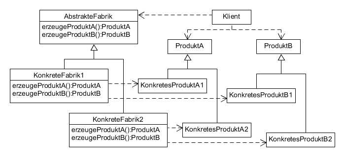

# Abstract Factory example



**Participants:**

* AbstractFactory: declares an interface for operations that create abstract product objects.
* ConcreteFactory: implements the operations to create concrete product objects.
* AbstractProduct: declares an interface for a type of product object.
* ConcreteProduct: defines a product object to be created by the corresponding concrete factory; implements the AbstractProduct interface.
* Client: uses only interface declared by AbstractFactory and AbstractProduct.

**AbstractFactory:**

  ```java
  public interface PizzaFactory {
    String createCrust();

    String createTopping();
  }
  ```
  
**ConcreteFactoryA:**

  ```java
  public class AmericanPizzaFactory implements PizzaFactory {
    @Override
    public String createCrust() {
      return new AmericanCrust().getType() + " crust";
    }

    @Override
    public String createTopping() {
      return new AmericanTopping().getType() + " topping";
    }
  }
  ```
  
**ConcreteFactoryB:**

  ```java
  public class ItalianPizzaFactory implements PizzaFactory {
    @Override
    public String createCrust() {
      return new ItalianCrust().getType() + " crust";
    }

    @Override
    public String createTopping() {
      return new ItalianTopping().getType() + " topping";
    }
  }
  ```
  
**AbstractProductA:**

  ```java
  public interface Crust {
    String getType();
  }
  ```
  
**ConcreteProductA1:**

  ```java
  public class AmericanCrust implements Crust {
    @Override
    public String getType() {
      return "thick";
    }
  }
  ```
  
**ConcreteProductA2:**

  ```java
  public class ItalianCrust implements Crust {
    @Override
    public String getType() {
      return "thin";
    }
  }
  ```

**AbstractProductB:**

  ```java
  public interface Topping {
    String getType();
  }
  ```
  
**ConcreteProductB1:**

  ```java
  public class AmericanTopping implements Topping {
    @Override
    public String getType() {
      return "cheese";
    }
  }
  ```
  
**ConcreteProductB2:**

  ```java
  public class ItalianTopping implements Topping {
    @Override
    public String getType() {
      return "salami";
    }
  }
  ```
  
**Client:**

  ```java
  public class FactoryProducer {
    public static PizzaFactory getPizzaFactory(String pizza) {
      if (pizza.equalsIgnoreCase("ITALIAN")) {
          return new ItalianPizzaFactory();
      } else if (pizza.equalsIgnoreCase("AMERICAN")) {
          return new AmericanPizzaFactory();
      }

      return null;
    }
  }
  ```
  
**Demo:**

  ```java
  public class Main {
    public static void main(String[] args) {
      PizzaFactory americanPizza = FactoryProducer.getPizzaFactory("american");
      PizzaFactory italianPizza = FactoryProducer.getPizzaFactory("italian");

      System.out.println("American pizza: " + americanPizza.createCrust() + " + " + americanPizza.createTopping());
      System.out.println("Italian pizza: " + italianPizza.createCrust() + " + " + italianPizza.createTopping());
    }
  }
  ```

**Output:**

  ```
  American pizza: thick crust + cheese topping
  Italian pizza: thin crust + salami topping
  ```
