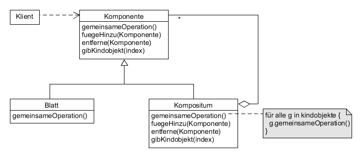

# Composite example

Fügt Objekte zu Baumstrukturen zusammen, um Hierarchien zu repräsentieren. Einheitliche Behandlung von Objekten wie Aggregaten.



**Participants:**

* Component: declares the interface for objects in the composition; implements default behavior for the interface common to all classes.
* Leaf: represents leaf objects in the composition; defines behavior for primitive objects in the composition.
* Composite: defines behavior for components having children; stores child components; implements child-related operations in the Component interface.
* Client: manipulates objects in the composition through the Component interface.

**Component:**

  ```java
  public abstract class Employee {
    abstract void add(Employee employee);

    abstract List<Employee> getSubordinates();

    abstract String getName();

    void print() {
      System.out.println("Employee: " + getName());
    }
  }
  ```
  
**Leaf:**

  ```java
  public class Developer extends Employee {
    private String name;

    public Developer(String name) {
      this.name = name;
    }

    @Override
    public void add(Employee employee) {
      // a leaf has no children
    }

    @Override
    public List<Employee> getSubordinates() {
      return null;
    }

    @Override
    public String getName() {
      return name;
    }
  }
  ```
  
**Composite:**

  ```java
  public class Manager extends Employee {
    private String name;
    private List<Employee> employees;

    public Manager(String name) {
      this.name = name;
      employees = new ArrayList<>();
    }

    @Override
    public void add(Employee employee) {
      employees.add(employee);
    }

    @Override
    public List<Employee> getSubordinates() {
      return employees;
    }

    @Override
    public String getName() {
      return name;
    }
  }
  ```
  
**Demo:**

  ```java
  public class Main {
    public static void main(String[] args) {
      Manager generalManager = new Manager("Michael");
      Employee manager = new Manager("Phillip");
      Employee developer1 = new Developer("Peter");
      Employee developer2 = new Developer("Angela");
      Employee developer3 = new Developer("Johannes");

      generalManager.add(manager);
      generalManager.add(developer1);
      manager.add(developer2);
      manager.add(developer3);

      generalManager.print();

      for (Employee emp : generalManager.getSubordinates()) {
        System.out.print("  ");
        emp.print();

        if (emp.getSubordinates() == null) {
        } else {
          emp.getSubordinates().forEach(e -> {
            System.out.print("    ");
            e.print();
          });
        }
      }
    }
  }
  ```
  
**Output:**

  ```
  Employee: Michael
    Employee: Phillip
      Employee: Angela
      Employee: Johannes
    Employee: Peter
  ```
