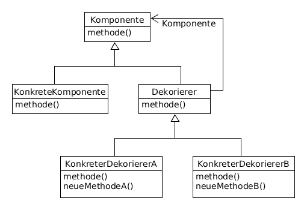

# Decorator example

Fügt dynamisch neue Funktionalität zu einem Objekt hinzu, kann Subjektschnittstelle erweitern &rarr; Alternative zur Vererbung



**Participants:**

* Component: defines the interface for objects that can have responsibilities added to them dynamically.
* ConcreteComponent: defines an object to which additional responsibilities can be attached.
* Decorator: maintains a reference to a Component object and defines an interface that conforms to Component's interface.
* ConcreteDecorator: adds responsibilities to the ConcreteComponent.

**Component:**
  
  ```java
  public interface Shape {
    void draw();
  }
  ```

**ConcreteComponent:**

  ```java
  public class Circle implements Shape {
    @Override
    public void draw() {
      System.out.println("Shape: Circle");
    }
  }
  ```
  
**Decorator:**

  ```java
  public abstract class ShapeDecorator implements Shape {
    protected Shape decoratedShape;

    public ShapeDecorator(Shape decoratedShape) {
      this.decoratedShape = decoratedShape;
    }

    public void draw() {
      decoratedShape.draw();
    }
  }
  ```
  
**ConcreteDecorator:**

  ```java
  public class RedShapeDecorator extends ShapeDecorator {
    public RedShapeDecorator(Shape decoratedShape) {
      super(decoratedShape);
    }

    @Override
    public void draw() {
      decoratedShape.draw();
      setBorderColor(decoratedShape);
    }

    private void setBorderColor(Shape decoratedShape) {
      System.out.println("Border color: Red");
    }
  }
  ```

**Demo:**

  ```java
  public class Main {
    public static void main(String[] args) {
      Shape circle = new Circle();
      circle.draw();

      System.out.println("");

      Shape redCircle = new RedShapeDecorator(circle);
      redCircle.draw();
    }
  }
  ```

**Output:**

  ```
  Shape: Circle

  Shape: Circle
  Border color: Red
  ```
  
**Compared with [Proxy](https://github.com/YuKitAs/tech-note/blob/master/design-patterns/decoupling-patterns/proxy-example.md) design pattern:**

Decorator always gets reference for decorated object (its delegatee, usually through constructor), while a Proxy might create the delegatee himself, or have it injected.
