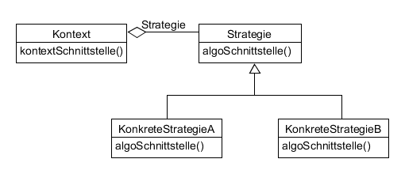

# Strategy example

Definiert eine Familie von Algorithmen, kapselt sie und macht sie austauschbar.

_Anwendung_: Viele verwandte Klassen, die sich nur in ihrem Verhalten unterscheiden; unterschiedliche Verhaltensweisen für eine Klasse.



**Participans:**

* Strategy: declares an interface common to all supported algorithms.
* ConcreteStrategy: implements the algorithm using the Strategy interface.
* Context: configured with a ConcreteStrategy object; maintains a reference to a Strategy object.

**Strategy:**

  ```java
  public interface Operation {
    int perform(int num1, int num2);
  }
  ```
  
**ConcreteStrategyA:**

  ```java
  public class Add implements Operation {
    @Override
    public int perform(int num1, int num2) {
      return num1 + num2;
    }
  }
  ```

**ConcreteStrategyB:**

  ```java
  public class Multiply implements Operation {
    @Override
    public int perform(int num1, int num2) {
      return num1 * num2;
    }
  }
  ```
  
**Context:**

  ```java
  public class Context {
    private Operation operation;

    public Context(Operation operation) {
      this.operation = operation;
    }

    public int performOperation(int num1, int num2) {
      return operation.perform(num1, num2);
    }
  }
  ```
  
**Demo:**

  ```java
  public class Main {
    public static void main(String[] args) {
      Context context = new Context(new Add());
      System.out.println("2 + 3 = " + context.performOperation(2, 3));

      context = new Context(new Multiply());
      System.out.println("2 * 3 = " + context.performOperation(2, 3));
    }
  }
  ```
  
**Output:**

  ```
  2 + 3 = 5
  2 * 3 = 6
  ```
