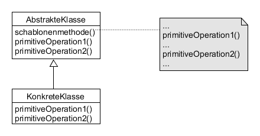

# Template Method example

Definiert das Skelett eines Algorithmus in einer abstrakten Klasse, wobei einzelne Schritte (werden auch Einschubmethoden oder Hooks gennant) an die Unterklassen delegiert werden. Unterklassen könne einzelne Schritte des Algorithmus verändern, nicht aber seine Struktur.

Zweck: Festlegen der Struktur eines Algorithmus, Herausziehen gemeinsamen Verhaltens.



**Participants:**

* AbstractClass: defines abstract primitive opertaions that concrete subclasses define to implement steps of an algorithm; implements a template method defining the skeleton of an algorithm.
* ConcreteClass: implements the primitive opertaions to carry out subclass-specific steps of the algorithm.

**AbstractClass:**

  ```java
  public abstract class Game {
    abstract void start();

    abstract void end();

    final void play() {
      start();
      end();
    }
  }
  ```
  
  
**ConcreteClass:**

  ```java
  public class PokemonGo extends Game {
    @Override
    void start() {
      System.out.println("Pokemon Go started.");
    }

    @Override
    void end() {
      System.out.println("Pokemon Go ended.");
    }
  }
  ```
  
Here `start()` and `end()` are "hook" methods (Einschubmethode) which work as placeholders.
  
**Demo:**

  ```java
  public class Main {
    public static void main(String[] args) {
      Game game = new PokemonGo();
      game.play();
    }
  }
  ```
  
**Output:**

  ```
  Pokemon Go started.
  Pokemon Go ended.
  ```

**Compared with [Factory Method](https://github.com/YuKitAs/tech-note/blob/master/design-patterns/variants-patterns/factory-method-example.md) design pattern:**

The Factory Method pattern is typically used in conjunction with a special case of the Template Method pattern.
