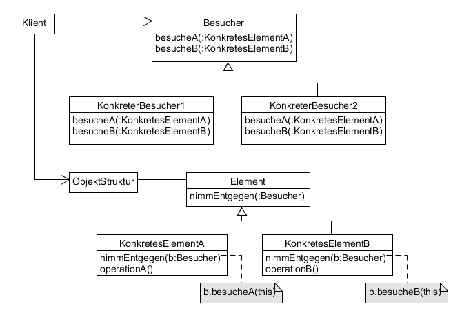

# Visitor example

Kapselt eine Operation auf Elementen einer Struktur als ein Objekt.

Zweck: Definition einer neuen Operation auf Klassen, ohne diese Klassen zu verändern.



**Participants:**

* Visitor: declares a Visit operation for rach class of ConcreteElement in the object structures.
* ConcreteVisitor: implements each operation declared by Visitor.
* Element: defines an Accept operation that takes a visitor as an argument.
* ConcreteElement: implements an Accept operation.
* ObjectStructure: can enumerate its elements; may provide an interface to allow the visitor to visit its elements.

**Visitor:**

  ```java
  public interface Visitor {
    void visit(Apple apple);

    void visit(Kiwi kiwi);
  }
  ```
  
**ConcreteVisitor:**

  ```java
  public class TotalPriceVisitor implements Visitor {
    private int totalPrice;

    @Override
    public void visit(Apple apple) {
      totalPrice += apple.getPrice() * apple.getQuantity();
    }

    @Override
    public void visit(Kiwi kiwi) {
      totalPrice += kiwi.getPrice() * kiwi.getQuantity();
    }

    public int getTotalPrice() {
      return totalPrice;
    }
  }
  ```
  
**Element:**

  ```java
  public interface Visitable {
    void accept(Visitor visitor);
  }
  ```
  
**ConcreteElementA:**

  ```java
  public class Apple implements Visitable {
    private int price;
    private int quantity;

    public Apple(int price, int quantity) {
      this.price = price;
      this.quantity = quantity;
    }

    @Override
    public void accept(Visitor visitor) {
      visitor.visit(this);
    }

    public int getPrice() {
      return price;
    }

    public int getQuantity() {
      return quantity;
    }
  }
  ```
  
**ConcreteElementB:**

  ```java
  public class Kiwi implements Visitable {
    private int price;
    private int quantity;

    public Kiwi(int price, int quantity) {
      this.price = price;
      this.quantity = quantity;
    }

    @Override
    public void accept(Visitor visitor) {
      visitor.visit(this);
    }

    public int getPrice() {
      return price;
    }

    public int getQuantity() {
      return quantity;
    }
  }
  ```
  
**ObjectStructure:**

  ```java
  public class ShoppingCart {
    private List<Visitable> items;

    public ShoppingCart(List<Visitable> items) {
      this.items = items;
    }

    public int calculateTotalPrice() {
      TotalPriceVisitor visitor = new TotalPriceVisitor();
      items.forEach(item -> item.accept(visitor));

      return visitor.getTotalPrice();
    }
  }
  ```
  
**Demo:**

  ```java
  public class Main {
    public static void main(String[] args) {
      List<Visitable> fruits = new ArrayList<Visitable>();
      fruits.add(new Apple(2, 2));
      fruits.add(new Kiwi(1, 6));

      ShoppingCart cart = new ShoppingCart(fruits);
      System.out.println("Total price: " + cart.calculateTotalPrice());
    }
  }
  ```
  
**Output:**

  ```
  Total price: 10
  ```
